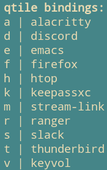

I live in the terminal  more than any other application.

Lots of my personal scripts are now in `bash`, and not `python` (though they used to be be); I've become a real fan of pipes. As a somewhat basic example, this prints out my IP information, using `curl` to make a request and `jq` to parse the JSON.

```
curl -s ipinfo.io | jq -r 'to_entries[] | "\(.key): \(.value)"'
```

For personal scripts/one-liners, I find satisfaction in seeing how much I can do by just pipelining commands together. This next command sends me a notification, describing key-combinations which launch applications in `qtile`:

```
notify-send -t 10000 "qtile bindings:" "$(qtile-bindings --json | jq -r '[.[]|select(.modifier=="control, mod4")] | .[] | "\(.keysym) | \(.command)"' | sed -e "s/spawn('//" -e "s/')$//" -e "s/launch //" -e "s/-developer-edition//" -e "/qtile-notify-bindings/d")"
```



On top of that, I find it to be a fun process, tacking on commands to iteratively modify output.

I've been doing some research on other shells that exist, but I don't think I'd want to use one of the non-POSIX compliant shells as my daily shell, since I don't want to lean on an external syntax. If I was to pick one, it'd probably be [elvish](https://elv.sh/).

[Oil](https://github.com/oilshell/oil) seems like an interesting project, but its more about properly parsing the POSIX/`bash` AST, and making shell code more secure. The creator was previously working on [Oil as an entirely new language](https://www.oilshell.org/blog/2017/02/05.html), but they've stopped development on that for now.

The Oil [External Resources](https://github.com/oilshell/oil/wiki/ExternalResources) is great for finding alternatives though. It has lots of peoples' random extensions to shells.

Unless something like `Oil` comes about which has full POSIX support, but also a large enough community that shell customization is a thing, I don't think I'm going to be replacing `bash`/`zsh` anytime soon.

### Improving Pipelines

Disregarding portability, I still think there could be tools to make shell-like code better. `bash` isn't great at processing text, so thats why tools like `awk`/`sed` are used. Learning how `IFS`, arrays and loops (word/line splitting) work in `bash` does help a lot, but theres still times where things feels like a hack (e.g. using [`curl` and checking HTTP codes](https://superuser.com/questions/272265/getting-curl-to-output-http-status-code)).

Currently, what I typically do is just write another tool/create an `alias` with 5 pipelines, with heavy use of `sed`/`awk`/`xargs`. Thats *okay* for me, but it isn't readable, and it's not great to debug/modify.

On a related note, `curl | jq` to get some basic interaction with JSON APIs is great, but at some point when you're dealing with structured data and doing conditional logic based on it, trying to store individual list items in shell/`bash` variables gets to be really confusing. Associative arrays and arrays *can* work, but it gets to be very unreadable, and you have no type safety/error checking. I tend to [fall back to python](https://github.com/seanbreckenridge/projects) in situations like that.

So, at some point it may make sense to fall back onto (for a script)/call out to (for command line pipelines) other interpreted languages (like `python`/`ruby`), but thats typically a *noticeable* drop in speed; I do value the speed of the shell (don't think I'd use [`xonsh`](https://xon.sh/index.html) interactively, though it does look cool) and using minimal tools like `curl`/`jq`.

On one hand, if there was a nicer, extendible DSL like [`mario`](https://github.com/python-mario/mario) (but written in something faster than `python`, and didn't require me to use `pipx` to run it from a virtual environment) which supported:

  * processing text (with convenience functions for typical string operations)
  * complex operations currently handled by `curl`/`jq`, like making HTTP requests, parsing JSON/XML
  * maintain a shell like DSL/syntax, so you could construct pipelines and receive text from STDIN and do `map`/`filter`/`reduce` across lines

... I could totally see myself using it for personal/throwaway scripts.

On the other hand, at some point that DSL turns into its own interpreted language, and you're just re-writing `ruby` or `python`. (Often those tools are written in `python` as well, so your startup time is bad anyways).

For text manipulation, I can see myself replacing `tr`/`sed`/`cut`/`awk` with `perl` (see the `perlre` and `perlrun` `man` pages). That has the benefit of being portable and the startup time for `perl` is **way** better than `python`/`ruby`, so using it in pipelines is okay.

```
$ hyperfine -S sh 'perl' -S sh 'python' -S sh 'ruby'
 ....
'perl' ran
   16.34 ± 10.22 times faster than 'python'
   27.57 ± 15.38 times faster than 'ruby'
```

`python` in particular has tons of great libraries, so it can often be the solution ([see my `giturl` script](https://sean.fish/d/giturl) (for [`gitopen`](https://sean.fish/d/gitopen)))

But otherwise, I'm in this middle ground of having to make a decision between funky looking `bash` pipelines and flawed data structures, and decreasing performance by calling out to a larger library in `python`/some other language.

I really like the brevity of pipes, so `mario`-like projects which approach the problem by creating a small DSL which acts on STDIN is what I want, but I can't seem to find one that meets my criteria.

When writing throwaway commands, I often find myself doing `some command | xargs -I "{}" sh -c "{}"`, or creating a `bash` script which reads from STDIN to a `while` loop - to do multiple subshells out to `grep`/`sed` against each line.

But! I'm not totally satisfied with that, and I wish there was a better way!

### Possible Solutions

* Find something that works like `mario`, but not in python and is extendible, or go through the arduous task of writing something myself in `go`/`rust`.
* Hope for an interactive shell which is a superset of the POSIX standard while providing convenience functions like `elvish` to become semi-popular.
