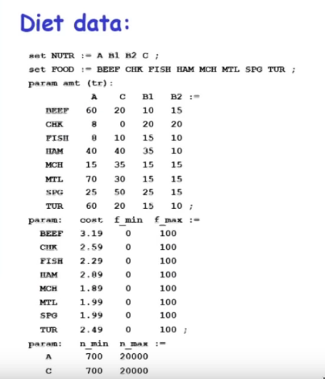
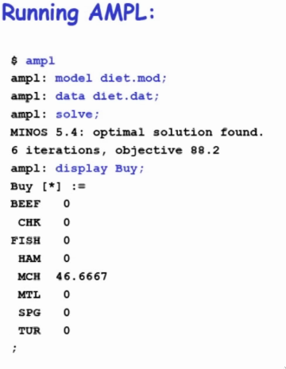

Notes from [Brian Kernighan Lecture](https://www.youtube.com/watch?v=Sg4U4r_AgJU):

You're probably not going to design the next major General Purpose (C++/Java/Go/Rust) or Scripting (Perl/Python/JS) language, but you may make a DSL/language for a particular domain.

For context, some other DSLs worth mentioning (regex, shell, awk, XML, HTML, LaTeX, SQL)

### Notation Matters

Considerations when making a DSL

"Language determines the way we think and determines what we can think about." - _Benjamin Whorf_

"A programming language that doesn't change the way you think is not worth learning" - _Alan Perlis_

### Case Study: AWK

Meant for doing simple text manipulation tasks, that you think should only be one line of code.

A program is a sequence of pattern-action statements

```
pattern { action }
pattern { action }
```

Patterns are regex, or string/numeric comparisons, which run if the action matched.

Pattern-Action is the same thing that sed/grep/lex/yacc uses

Pattern-Action is very good for small programs because the 'if-then' structure is how we think when tacking small problems.

For actions, build on something people already know. awk has a C-like syntax because lots of people knew C.

Automate what you know people will often do with your tool. That may mean adding flags for common use cases, or fallback to defaults/coerce types/strings into what you need depending on the context.

### Lessons from other people using your languages

- If you do anything useful, people will abuse it.
  - You will get _nowhere_ trying to stop people from extending it, so the domain either should be well defined, or you should be fine with people doing what they want
- Existence of a language encourages programs to generate it, to facilitate complicated or handle otherwise impossible cases
  - machine generated inputs stress differently than people do
- Mistakes are inevitable and hard to change
- creeping feature-ism from user pressure and other implementations (do you keep your codebase the same so people who know it still know it? or do you change core aspects because you had a better idea?)

### Case Study: AMPL

AMPL is a DSL for describing optimization problems and then compiling descriptions into solver problems

It optimizing some problem given constraints, and data.


The data is modeled with a data specification language, which looks a lot like sparse matrices.



The last part of AMPL was how you'd run it, the command language (i.e. the CLI interface)



Whether or not a DSL needs all of these (or how complicated/strict they should be) should be considered. If something doesnt need a way to describe a problem, and just data and the CLI, it shouldnt have a command interface. Maybe that command interface could be replaced with a couple CLI flags, like many unix tools are.

---

AMPL was moderately successful, taught in university courses, used as an optimization tool in industry.

It started as a purely declarative (e.g. SQL) language that solved a particular problem, but gradually added the mechanism of programming languages (conditionals, loop, functions/procedures)

However, it wasn't originally designed for that, so adding all those trapping makes it a bit odd to read, and syntax may not be where you expect.

Sidenote: AMPL is proprietary -- need to pay for it. No one really wanted to go build a optimization solver for fun, so a big open source alternative doesn't seem to exist.

### Case Study: EQN

TypeSets mathematical equations by piping into troff. (idea: a language that matches the way mathematics is spoken (x 'sub' i equals pi) into fancy looking documents)


Is simpler than Tex/LaTeX, but that can also work in your favor that someone doesn't have to install/configure/learn how it works. E.g. If its a simple command that works with pipes (what you already know), its easy to integrate/teach to people who know nothing about it.

### Case Study: Pic

Textual descriptions of line drawings (think: used for flow charts)


The first version of pic had no notion of loops or conditionals. But, people needed it to do certain things, so it got added, with a horrible syntax.

---

On machine generated input to your DSL:

If the heavy lifting for your DSL can be handled/piped into by an well established tool, and you have relative certainty that it won't break because of changes to the external tool, there are lots of benefits to separating the concerns of 'how to do the thing' with 'what your thing does'

Your tool could just be an adjustment on an implementation of a complicated algorithm, or a simplification of the interface to the complex tool, which then gets handled by the external tool.

'If an idea is good, making it recursive makes it better'

## Why languages succeed

- solve real problems in a clearly better way
  - notation matters
- culturally compatible and familiar
  - familiar syntax helps (C-like)
  - easy to get started with (documentation ?)
  - potable to new environments
- environmentally compatible
  - isn't proprietary/limited behind hardware
  - can link to standard tools and libraries
  - is open source
- weak competition (no other language exists in this problem space)
- good luck (or good advertising ?)

E.g. C had good luck (timing, came about the time of mini computers, then got a new burst of life with workstations (e.g. Sun), then another burst with the PC, then another with embedded systems)

## Why languages fail to thrive

- niche or domain disappears (what happened with Pic when troff died)
- poor engineering
  - too big, too complex, too slow, too late
  - incompatible with environments
- poor philosophical choices
  - ideology over functionality
  - single programming paradigm
  - too "mathematical"/"theoretical" (maybe FP falls into here for most people?)
  - too different, too incompatible

---

"There will always be things we wish to say in our programs that in all known languages can only be said poorly."

- Alan Perlis

(So go make a DSL!)
