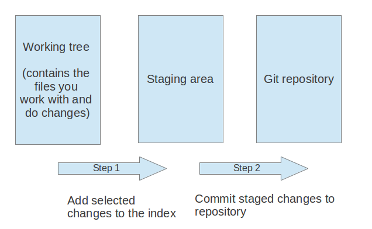

`git commit -p` lets you do hunk-based commits, sort of like running lots of `--patch`es.

`git stash` acts like a stack, `apply` applies changes from the top of the stack but doesnt remove, `pop` applies and removes.

# Git

### Status of File according to git:

- untracked: the file is not tracked by the Git repository. This means that the file never staged nor committed.
- tracked: committed and not staged
- staged: staged to be included in the next commit
- dirty / modified: the file has changed but the change is not staged




"staging area" is also sometimes called "index" -- the file that the git repository has indexed.

### Deleting files

`git rm <filename>` -- this also removes the file

`git rm --cached <filename>` -- doesnt remove file

### HEAD

`HEAD` is a common term that is used, which refers to the currently checked out branch. If you switch branches, the HEAD then points at the latest commit of the newest branch.

`git diff` using `HEAD`:

- `git diff HEAD~1 HEAD`
- `dit diff HEAD^ HEAD`
- `git diff HEAD^^ HEAD`
- `git diff HEAD~3 HEAD file`

### Resetting

`git reset`: `--hard` vs `--soft`

For example:

moving remote back a commit. If you have force push access to origin

```
git reset --hard HEAD~1
git push -f
```

`git reset --hard` removes the changes since the last commit. you can also do `git reset --soft`, which leaves the last commit as staged changes.

If you want to add something to a previous commit, you can use `git reset --soft` and `git commit --amend`

### Merging using `stash`

`git stash` records the current state of the working directory and the index, but resets you back to `HEAD`.

Works as a stack:

- third stashed changes
- second stashed changes
- first stashed changes

`git stash pop` would remove 'third stashed changes', and apply the changes to the current index. Then, `git stash pop` again would apply the second stashed index. `git stash apply` is like pop, it applies whats at the top of the stack to the index, but it doesnt remove the item from the top of the stack.

`git stash branch` creates a new branch from the context of when you did `git stash`

`git stash drop`/`git stash clear` removes anything currently stashed

If merging with remote but you want to put the changes from upstream before yours, or you're getting a merge conflict because you have changed files:

```
git stash
git pull
git stash apply
```

To apply your changes on top of the remote changes. Its possible that you'll still get merge conflicts, but your git history will be the same.

[website to visualize `git`](https://git-school.github.io/visualizing-git/)

Can use dots to show diffs between branches/tags/commit hashes

- `git diff master..featurex`
- `git diff HEAD..featurex`
