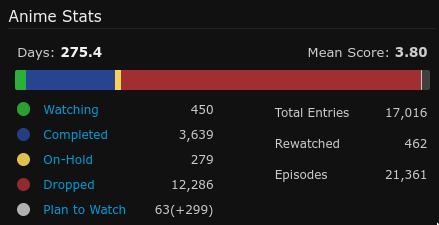
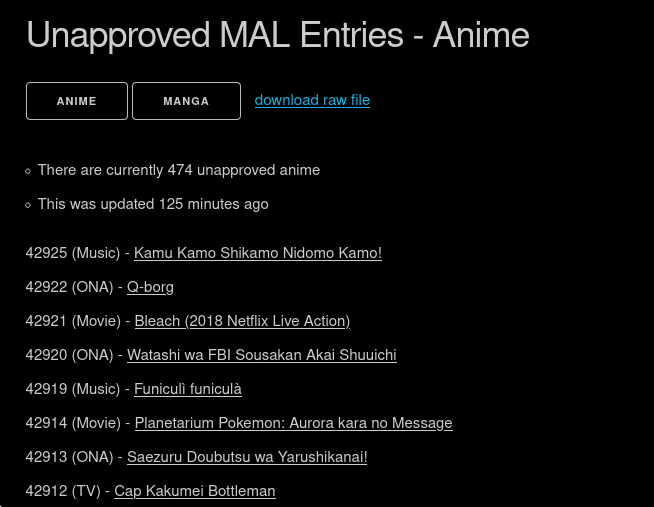

For general thoughts on online databases, see [online databases](/media/online_databases/).

### MAL?

Though there's downtime, the site/API was down for months and due to the owners changing, always feels like third party developers aren't a priority, [MyAnimeList](https://myanimelist.net) (MAL) has the most history, experienced users and entries (most entries is a big factor for me). Some of the more recent sites (e.g. [AniList](https://anilist.co/)) started off by taking MALs data, often mapping IDs one-to-one. Having lots of users also means sources for obscure entries might be listed in the forums for each entry.

Since 2015, I've spent _a lot_ of time watching anime. Less recently, because I've somewhat exhausted all the things I'm interested in. I used [`MAL`](https://myanimelist.net) as a database of sorts:

- sort entries into short films, TV shows, lost media, things I'm interested in using tags
- watch some of each entry, to see if I like it. On MAL, I use categories like:
  - `watching`: things I haven't tried yet
  - `completed`: things I've watched/finished
  - `on-hold`: things I've watched some of/am interested in continuing
  - `dropped`: things I've dropped, or sequels of things I've dropped (since I'm not interested in continuing those)
  - `plan to watch`: things that haven't aired yet

(So, at the time of writing this, there's 12286 entries that I've tried and dropped, or otherwise categorized into 'not interested in')

There was a point in early 2017 where I had watched every music video/short film on MAL, and there wasn't what I considered to be a comprehensive list, so I ended up creating [a list of my favorites](https://sean.fish/animeshorts/).

Ended up writing [lots of userscripts](https://greasyfork.org/en/scripts?set=22083) for MAL, because it isn't the best out of the box. ([Github Repo](http://github.com/seanbreckenridge/greasyfork))

In the past, and somewhat now, I've used the MAL database to discover new interesting short films/music videos to watch.

The approval process for MAL entries isn't transparent, and as someone who has most of the entries on their list, looking if any new ones have been approved, it can be annoying to manually look at recently approved entries every day. So, I have a [process](https://github.com/Hiyori-API/checker_mal) that runs on my server to check if new entries have been approved, which updates a couple json files, a [website](https://github.com/seanbreckenridge/mal-unapproved) to list unapproved entries, and a [discord bot](https://github.com/seanbreckenridge/mal-notify-bot) to notify me whenever new ones are added.

### Other sites?

MALs API was dead for a while, so I use [Jikan](https://github.com/jikan-me/jikan-rest/) instead, which scrapes the website (I host my own instance of the scraper on my server, [dockerized](https://github.com/seanbreckenridge/docker-jikan)). I've become pretty active in that community, and plan to create some other projects with some of the people there to help improve data in the different online databases, and connect user lists/data across different websites (see [Hiyori](https://www.patreon.com/posts/30063841))

Currently, its quite frustrating to maintain projects that depend on Jikan/MAL, MALs recently been blocking scrapers since their official API has been released (though its not well documented, and I'm not a fan of how they handled OAuth). I'm quite entrenched in the MAL community, but I may switch to AniList at some point, in addition to maintaining a local cache of my MAL list using Hiyori.

Though, If one is submitting new entries to one of the databases, though the site isn't the best, you're better off submitting entries to MAL, because the other sites _know_ that MAL has the most entries and they all copy data/source entries from it. You improve most of sites by submitting to MAL, while it can sometimes feel like you're wasting time submitting entries to other sites that might not have as much reach.

[AniList](https://anilist.co/) looks much nicer from a developers point of view, being Graphql, with owners/leads who communicate much more frequently. However, there are concerns with managing a large list with their API; there's a limit to how many can be shown on their web interface, and I [can't really import my list](https://anilist.co/forum/thread/33798)

[Kitsu](https://kitsu.io) is another option but its just not as complete/also suffers from occasional downtime

The [AniDB Title Dump](https://wiki.anidb.net/API#Anime_Titles) may be useful for particular projects.

May be worth to move to AniDB or AnimePlanet, but those have smaller communities.

---

At this point (late 2020), I'm a bit less invested. I watch anime sometimes, I have lots of discord/communities I'm in because of anime, and friends I've made because of it. I still collect rare sources/track down short films, and maintain my couple live projects for the other dozen or so power users. I'm more focused on moving away from the databases, and trying to maintain/create data dumps (resulting in <https://dbsentinel.sean.fish/>) to improve the consistency/quality of the data, so its easier to archive and do analysis on.
