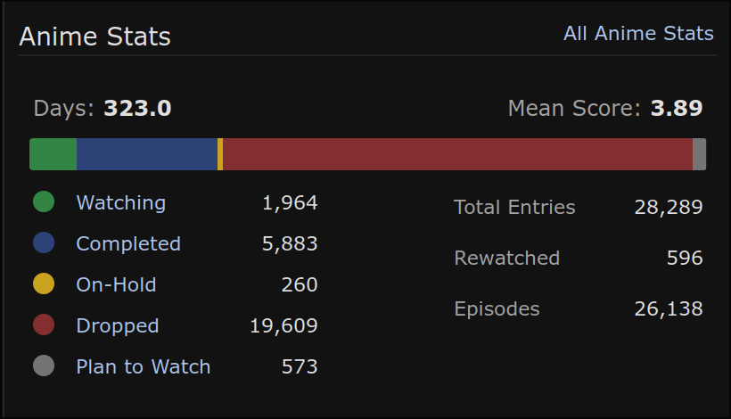
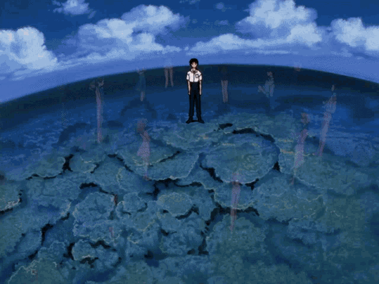

#### So that I (or maybe you!) can link to this when people wrongly assume why my list is like it is.

Here are my lists:

- [MAL](https://myanimelist.net/profile/purplepinapples)
- [AniList](https://anilist.co/user/purplepinapples/)

As an image, to jumpscare:



Yes, I get this looks wild, but I have not really dropped _19,000_. I have only dropped _4,000_.

Heres my list classified by a few categories:

```
Filter                                                                 Count  Runtime           Mean Score
-------------------------------------------------------------------  -------  ----------------  ------------
Completed                                                               5981  284.53 days       4.13
Completed TV Shows                                                       448  219.81 days       6.19
Completed Movies over an hour long                                       230  17.51 days        5.97
Completed OVA series                                                     148  17.40 days        6.06
Completed with a total runtime under 30 minutes                         4981  21.22 days        3.75
Completed music videos                                                  2482  6.76 days         3.73
On hold                                                                  260  Left: 73.51 days  5.92
Dropped I actually watched some of                                      4006  42.14 days        3.57
Dropped Donghua I watched some of                                        199  0.98 days         3.83
Dropped for categorization reasons (sequel, no raws/subs available)    14098  -                 -
```

Over the past 10 years of watching anime, I've seen 448 TV shows and 230 movies (which feels like a quite normal amount of anime to have seen, if you've been entrenched in the anime community for 10 years). The vast majority of my completed counts comes from watching random short anime under 30 minutes (short films, commercials, music videos, college graduation films)

There are a couple reasons my list looks the way it does, but its mostly:

### Shorts, Categorization, and Sunk Cost

About a year into my journey of watching anime, I got really into short films. I consumed lots of recommendation lists, and eventually ran out, and wanted more!

Being a college student with nothing but free time, I used [the shorts club](https://myanimelist.net/clubs.php?cid=14045) on MAL (anime with episodes under 15 minutes) to systematically go through the rest of the couple thousand entries to find all the ones I liked.

Crazy, I know. But I was a dissociated, socially anxious, 18 year old. _What else was I going to do with my time_?

After doing so, I made a [website with all my favorites](https://purarue.xyz/animeshorts/), which I was (and am still) pretty happy with.

Watching all these short films involved searching for some rare anime, and I got pretty good at tracking down rare anime, from the typical sources, or finding handcams on russian/chinese sites. At this point I was also [watching NHK specials and music videos off Japanese TV](https://github.com/purarue/fuji), as well as trying to organize [Minna no Uta](https://myanimelist.net/clubs.php?cid=72940) (a NHK TV program that runs a few times a day)

To make sure I didn't do duplicate work, I would start categorizing things as 'Dropped' when I:

- [couldn't find RAWs](https://myanimelist.net/animelist/purplepinapples?status=4&tag=no%20raws) (no video, with or without subs)
- [couldn't find subs](https://myanimelist.net/animelist/purplepinapples?status=4&tag=no%20subs)

This was also about the time that the [Japanese Animated Film Classics](https://animation.filmarchives.jp/en/index.html) site went live, giving the internet access to dozens of 1920s-1940s films that were lost to time, so I went through them all in chronological order.

... and then, out of curiosity, I sort of just continued, by using the [new 'seasons' feature](https://myanimelist.net/anime/season/1965/winter) on MAL to continue into the 1950s, 60s and 70s...

I watched most of the movies, and at least the first episode of any of the TV shows through about 1975.

Which then got me curious to try other years, so I'd just pick a year (1975-2020) at random, and:

- Drop anything that was a sequel of something I had dropped
- Drop anything without subs or raws available
- And then try the first episode, or about the first 20 minutes of every movie from that year.

After a few years of this (around the 2017-2019 period), I had done this for almost every year of anime. I don't think I had ever categorized everything, but at one point I had about 100 shows left to try in the entire database, everything else I had either:

- Dropped for categorization reasons (which is about half of my list right now (14,098/29,289))
- Tried some of and dropped it, as it didn't grab my attention
- Watched an episode and enjoyed it, and put it on my On-Hold to get back to later.

If you had asked me at the time if I thought what I was doing was a good use of my time, I probably would've said something like:

> I haven't found any single persons' recommendations that I can trust, so this lets me find which anime I think are worth my time.

Does present me, _now_, think it was a good use of my time?

Not really, but I don't think it was pointless. I did [find](https://myanimelist.net/stacks/610) lots [of](https://myanimelist.net/stacks/30178) great [anime](https://myanimelist.net/stacks/48866), and quoting from another one of my blog posts:

> I think it was useful for me to get into something that was incredibly niche (weird, arthouse short films). It gave me an opportunity to understand my relationship to media without outside influence (because no one else was writing or talking about these films). It taught me to be intentional with my time, and always be considering what is actually bringing me joy or teaching me something and what is just noise.

Do I think, _you_, person following me on AniList should use my list as a litmus test for whether or not you should watch something?

If you want to, I guess. I never consider something dropped forever, most of my drops were snap judgements made in under 10 minutes to figure out if something appealed to me.

It is very possible that in the fugue state of trying dozens of anime per day, I judged too early and dropped something without giving it a fair chance. It's also possible that if I tried some of the anime I dropped again now -- 7 years later -- I would have a different opinion than I did as a 19 year old.

### Move to AniList

After the 2020 debacles of MAL being down all the time, I decided it would probably be a good idea to have a backup.

I tried migrating to anilist, but it would crash the importer since it was too large to be embedded in the request...

Since a bunch of entries we're not "real" anyways (dropped for raws/subs, or by relation because I dropped a prequel), I [wrote a script](https://github.com/purarue/malexport/blob/master/scripts/to_anilist.py) to filter my MAL list before importing it into AniList:

In particular:

> Removes any items which don't have activity (a score, start date, on my completed, or has some episode/chapter progress)

So, other than the couple hundred entries that did not import because they didn't exist on AniList, my AniList is far more accurate to my actual anime consumption.

During 2022-2024ish, whenever I would watch an episode I would mark it on both MAL and AniList (and I still do this, I just don't watch as much anime nowadays)

### Database Archival

Probably the most confusing to explain reason, but [I wrote and continually run an archival tool](https://purarue.xyz/dbsentinel/) which saves data from denied and deleted MAL entries, for the couple dozen power users that find that information useful (also see [the reasons listed on that page](https://purarue.xyz/dbsentinel/))

One of the strategies it uses to find deleted entries uses my MAL list, and if there are any entries that used to be on my list but aren't anymore, it requests those and checks if they no longer exist.

However, in order for that to work, my list has to have every database entry on it. So, every few days I run a script that puts every entry that is not currently on my list, on my list. That is why there are currently 1964 items on my currently watching -- I am not actually watching those, they just need to be on my list so my archival tool can continue to work.

---

And that's it! You are now an expert on why a random girlie on the internet has a weird anime list.


