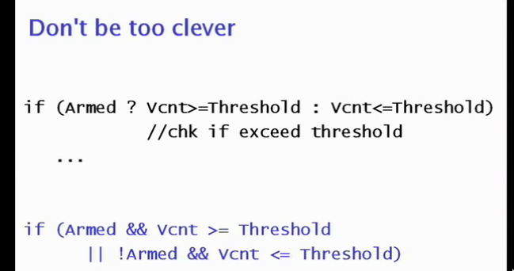
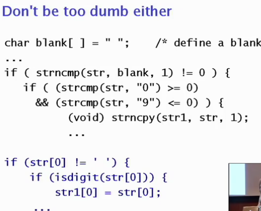
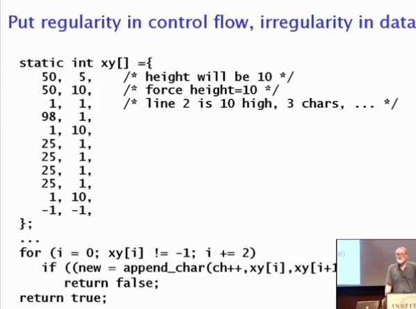

Notes from [Elements of Programming Style](https://www.youtube.com/watch?v=8SUkrR7ZfTA)

Using a bunch of library functions to check something basic just to satisfy 'correctness' or 'handling edge cases' when edge cases don't exists could make code unreadable.

When possible, write something without defining 'temporary looping/helper variables' to handle state in a function, and just write it so it can be read top -> bottom. For complicated things, this can't always be done, but often you can look for a library to hide that complexity for you, so you don't have to get it right.

Sometimes, bit manipulation is the right job to solve a problem (especially when doing an 'and' or 'or', to mask values). Sometimes, its totally unreadable and you'd be better off using temporary variables/logic to solve it.

Should be careful about order of operations when using bit operations with arithmetic operations -- arithmetic are typically higher precedence.

This can sort of be though of as squashing the side effect that `*--jext` has.

Macros are technically more efficient, but nowadays that function call it typically optimized away anyways -- no reason to use them for optimization.

_Avoid bad features of a language_

Just because something exists in the language (some weird conditional, macros, goto, 'bad' string operations), doesn't mean you should use them.

This makes your way code more readable for people who've used the languages before, and you don't often get it wrong -- in your head you're not going through individual steps, its a pattern you've learnt for this problem.

If you see something that is un-idiomatic:

- It may be wrong, the person who wrote it may not know the idiom.
- They may be doing something clever/using a side effect/language feature to do something in particular

Shouldn't have to be mentioned, but program defensively. In languages that require it, check for NULLs, check for edge cases, and else fail/warn/assert you way out of the function.

