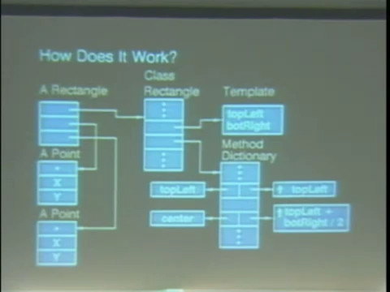

Read [Object Oriented Programming | Above the line view](http://inst.eecs.berkeley.edu/~cs61a/reader/aboveline.pdf)

Encompasses Lecture 18, 19, 20

OOP is a metaphor for multiple, independent, intelligent agents.

It describes some component as as an *instance* of a *class*, which has interactions with other classes.

The metaphor is that an object (*instance* of a class) "knows how" to do certain things, when passed messages (method names).

Objects have state, which defies all the functional stuff we've been doing previously. When classes are instantiated, you pass parameters to initialize the local state variables.

OO can be done in Scheme with `set!` and `method` to `define-class`es and their behaviour.

Its common to define a base class with implements some common functionality between components, and then *inherit* from that class to subclasses.

Smalltalk, which started OOP, had multiple inheritance, but lots of programming languages have decided that was a bad idea and don't include.

Note: Pythons Method Resolution Order for Multiple Inheritance is confusing, and complicated, but it has theory behind it and I think it works. See [Raymond Hettingers](https://www.youtube.com/watch?v=EiOglTERPEo) talk for context.

### Scheme-Specific:

The `instance-vars` function can be used to define instance variables which you don't want to provide when instantiating a class.

*class variables* are shared across all classes. Defined in scheme with `class-vars`.

Classes can define a `default-method`, which can receive any `message`, and then decide to do something with it.

`usual` is used to call super class methods.

When you define something as a child class, the `parent` instance of that class re-defines `self` as the child instance's `self`. Since this is all done through message passing, even while using methods from the parent class, calling methods on `self` sends messages to possibly re-defined methods in the child class, defaulting up the inheritance chain if they don't exist.

## SmallTalk Lecture

*Object-Oriented Programming Dan Ingalls*

If any part of a system depends on the internals of another part, then complexity increases as the square of the size of the system.

The mindset with which people developing smalltalk went at creating a system was trying to find a way to avoid the conventional style of dispatching on types when faced with the issue of generalizing procedures.

The Message Paradigm for smalltalk was inspired by Simula, which had solved this problem in a similar way.

In smalltalk:

```
<recevier> <message>
a size
a size + 5
```

send message `size` to `a`, get the resulting value, and then send `+ 5` to the resulting value.

You can also send blocks to objects, which languages like ruby inherited.



Inheritance/Polymorphism were standard in smalltalk, which made code more reusable across their implementations.

OS is just a collection of objects: directories, files, display, mouse, keyboard, primitive types. With that mindset, methods are primitive, but failure is handled in normal code.

#### Essential Characteristics

* Uniform refernce (everything is an object)
* Uniform access (only messages)
* These guarantee "Simulation" - since everything is handled by passing messages to another object, a new user-defined object acts in a similar way and can extend functionality without messing with existing code.

##### Language Design:

Comment on Javascript/Ruby:

These languages are rather hideous, they're based on every good idea at once.

When you program in scheme (or more generally, lisp), the big organizing idea is 'first class procedures'. Every problem is solved in that framework, and everything is uniform and semantics are simple (there aren't lots of rules/special forms). 

When you program in smalltalk, everything is done by sending messages to objects.

In 'Industrial Languages', they just take all the good ideas and cram the features into a language, even when it doesn't make the most sense to do so.
